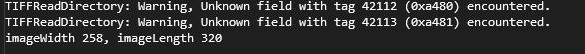

<div class="cat" id="top"> 
  
  &#xa0;
</div>
<h1 align="center">Opensource Kaynak Kod Derleme ve Linkleme İşlemleri</h1>

<p align="center">
  
  
</p>


<p align="center">
  <a href="#dart-açıklama">Açıklama</a> &#xa0; | &#xa0; 
  <a href="#sparkler-libtiff">LibTiff</a> &#xa0; | &#xa0;
  <a href="#octocat-zlib">Zlib</a> &#xa0; | &#xa0;
  <a href="#surfer-freetype">Freetype</a> &#xa0; | &#xa0;
  <a href="#dizzy-poco">Poco</a> &#xa0; | &#xa0;
  <a href="#art-openssl">OpenSSL</a> &#xa0; | &#xa0;
  <a href="#twisted_rightwards_arrows-odbc">ODBC</a> &#xa0; | &#xa0;
  <a href="#fish_cake-mysql-client">MySQL Client</a> &#xa0; | &#xa0;
  <a href="#dvd-postgresql-client">PostGreSQL Client</a> &#xa0; | &#xa0;
  <a href="#factory-d12">D12</a> &#xa0; | &#xa0;
  <a href="#sparkles-d34">D34</a> &#xa0; | &#xa0;
  <a href="https://github.com/otahsinb" target="_blank">Yazar</a>
</p>

<br>

## :dart: Açıklama ##

 Bu alan bir takım opensource projeleri güncel işletim sistemlerinde derleyerek kullanma adımlarını içermektedir.
 
:heavy_check_mark: Kaynak Kodlar :heavy_check_mark: Araçlar :heavy_check_mark: Derleme Adımları :heavy_check_mark: Linker Ayarları :heavy_check_mark: Best Practices

## :sparkler: LibTiff ##
 
  ```sh
    .
    ├── Tag Image File Format (TIFF) bir görüntü format türüdür.
    ├── Libtiff, TIFF dosyalarının manipülasyonunu destekleyen bir C fonksiyonları kümesidir (bir kütüphanedir).
    ├── Libtiff, görüntü verilerine farklı soyutlama katmanlarında arayüzler sağlar. 
    ├── Bu kütüphane, derleme yapmak için ANSI C derleme ortamını gerektirir ve kullanım için de bir ANSI C ortamını varsayar.
    ├── Yazılım 32 ve 64 bitlik makinelerde çalışabilmektedir.
    └── 16 bitlik makinelerde de çalışabilir fakat sıkıştırma gibi çeşitli yetenekler kısıtlanmış olacaktır.
  
  ```

<details>
  <summary> :musical_score: Adım Adım Derleme :musical_score: </summary> <br />
   
  |:musical_score:|   Linkten (http://www.libtiff.org/) Kaynak Kodları İndiriniz...🡓🡓🡓    |
  | ------- | --- |
  
  |:musical_score:|   Microsoft Visual Studio C++ 2022 kurulumunu yapınız.    |
  | ------- | --- |
  
  |:musical_score:|   Zip veya Tar.gz olarak indirilen LibTiff dosyasını WinRar benzeri bir yardımcı program ile açılarak extract ediniz. |
  | ------- | --- |
  
  |:musical_score:|   ' x64 Native Tools Command Prompt for VS 2022 ' programı açılarak  LibTiff'in açıldığı klasöre komut satırından gidilir. |
  | ------- | --- |
  | :musical_score: | Bu alanda <code style="color : fuchsia">BuildFolder\tiff-4.5.0</code> açılacaktır. |

  |:musical_score:|   ' x64 Native Tools Command Prompt for VS 2022 ' içinden aşağıdaki komutlar sırası ile çağrılır.🡓🡓🡓 |
  | ------- | --- |
  |         |  :arrow_forward:  ``` mkdir buildx86 ``` |
  |         |  :arrow_forward:  ``` cd buildx86 ``` |
  |         |  :arrow_forward:  ``` cmake .. ``` |
  |         |  :arrow_forward:  ``` cmake --build . --config Release ``` |
  
  |:musical_score:| Yukarıdaki komutlar ile build tree oluşturuldu ve ```buildx86\libtiff\Debug``` alanında lib ve dll uzantılı dosyalar üretildi. |
  | ------- | --- |
  |:musical_score:| ```BuildFolder\tiff-4.5.0\demo``` alanına *lib* ve *include* isimli klasörler açınız. |
  |:musical_score:| ```buildx86\libtiff\Debug``` alanındaki dosyalarını *lib* klasörünün içine kopyalayınız.|
  |:musical_score:| ```BuildFolder\tiff-4.5.0\libtiff``` içindeki dosyalarını *include* klasörünün içine kopyalayınız.|
  |:musical_score:| ```BuildFolder\tiff-4.5.0\out\build\x64-Debug\libtiff``` içindeki *tif_config.h* ve *tiffconf.h* isimli dosyaları *include* klasörünün içine kopyalayınız.|
  |:musical_score:|  Windows geliştirme ortamı için derleme işlemi tamamlanmıştır. |
  
  |:musical_score:|  Programın çalışmasını kontrol etmek için ```BuildFolder\tiff-4.5.0\demo\demo.cxx``` isimli bir dosya açınız . |
  | ------- | --- |
  |:musical_score:|  Aşağıdaki kodu kopyalayarak *demo.cxx* dosyası içine koyunuz. |
  
  ```c
#include <stdio.h>
#include "tiffio.h"

int main(int argc, const char* argv[])
{
    if (argc < 2) {
        printf("Usage: demo [TIFF file]\n");
        return 0;
    }
    const char* pszImageFile = argv[1];
    TIFF* tif = TIFFOpen(pszImageFile, "r");
    if (tif) {
        uint32 imageWidth, imageLength;
        uint16 compression;
        TIFFGetField(tif, TIFFTAG_IMAGEWIDTH, &imageWidth);
        TIFFGetField(tif, TIFFTAG_IMAGELENGTH, &imageLength);
        TIFFGetField(tif, TIFFTAG_COMPRESSION, &compression);
        printf("imageWidth %d, imageLength %d \n\n", imageWidth, imageLength);
        switch(compression) {
            case COMPRESSION_LZW:
                printf("COMPRESSION_LZW \n\n");
                break;
            case COMPRESSION_OJPEG:
                printf("COMPRESSION_OJPEG \n\n");
                break;
            case COMPRESSION_JPEG:
                printf("COMPRESSION_JPEG \n\n");
                break;
        }
        TIFFClose(tif);
    }
    return 0;
}
  ```
                 
  |:musical_score:|  Yukarıdaki kodun derlendiğini görmek için ```BuildFolder\tiff-4.5.0\demo\CMakeLists.txt``` isimli bir dosya açınız . |
  | ------- | --- |
  |:musical_score:|  Aşağıdaki kodu kopyalayarak *CMakeLists.txt* dosyası içine koyunuz. |

  ```c
  cmake_minimum_required (VERSION 2.6)
  project (demo)
  MESSAGE( STATUS "PROJECT_NAME: " ${PROJECT_NAME} )
                 
  link_directories("${PROJECT_SOURCE_DIR}/lib") 
  include_directories("${PROJECT_SOURCE_DIR}/include/")
                 
  # Add the executable
  add_executable(demo demo.cxx)
  target_link_libraries (demo "tiff")
  add_custom_command(TARGET demo POST_BUILD 
          COMMAND ${CMAKE_COMMAND} -E copy_if_different
          "${PROJECT_SOURCE_DIR}/lib/tiff.dll"              
          $<TARGET_FILE_DIR:demo>)
  ```
  
  
  |:musical_score:|  Developer Command Promptta ```BuildFolder\tiff-4.5.0\demo``` alanına gelerek aşağıdaki komutları sıra ile çalıştırınız. |
  | ------- | --- |
  |         |  :arrow_forward: ``` mkdir build ``` |
  |         |  :arrow_forward: ``` cd build ``` |
  |         |  :arrow_forward:  ``` cmake .. ``` |
  |         |  :arrow_forward:  ``` cmake --build . ``` |

  
  |:musical_score:|   **demo.exe** dosyasının olduğu klasör yolu gösterilerek aşağıdaki komutu örnek görüntülerde deneyiniz.  |
  | ------- | --- |
  |        |  :arrow_forward:   ``` BuildFolder\tiff-4.5.0\demo\build\Debug\demo.exe BuildFolder\tiff-4.5.0\demo\with_color_table.tif ``` |
  | Çıktı: |  imageWidth 162, imageLength 150 |
  |        |  :arrow_forward:  ``` BuildFolder\tiff-4.5.0\demo\build\Debug\demo.exe BuildFolder\tiff-4.5.0\demo\rgb_with_mask.tif ``` |
  | Çıktı: |    |
  |:musical_score:|   Projenizin external alanına yukarıdaki *lib* ve *include* klasörlerini eklediğinizde kullanıma hazırdır.  |
         
</details>


<a href="#top">Back to top</a>

## :octocat: Zlib ##

    .
    ├── 
    ├── 
    ├── 
    ├── 
    ├── 
    ├── 
    ├── 
    ├── 
    ├── 
    ├── 
    ├── 
    ├── 
    └── 


<details>
  
  <summary> Adım Adım Derleme </summary> <br />
  
  :musical_score: Kaynak Kodları (Aşağıdaki Linkten Kaynak Kodları İndiriniz...🡓🡓🡓)
 
</details>


<a href="#top">Back to top</a>

## :surfer: Freetype ##

    .
    ├── 
    ├── 
    ├── 
    ├── 
    ├── 
    ├── 
    ├── 
    ├── 
    ├── 
    ├── 
    ├── 
    ├── 
    └── 


<details>
  
  <summary> Adım Adım Derleme </summary> <br />
  
  :musical_score: Kaynak Kodları (Aşağıdaki Linkten Kaynak Kodları İndiriniz...🡓🡓🡓)
   
</details>


<a href="#top">Back to top</a>

## :dizzy: Poco ##

    .
    ├── 
    ├── 
    └── 


<details>
  
  <summary> Adım Adım Derleme </summary> <br />
  
  :musical_score: Kaynak Kodları (Aşağıdaki Linkten Kaynak Kodları İndiriniz...🡓🡓🡓)
   
</details>

<a href="#top">Back to top</a>

## :art: OpenSSL ##

    .
    ├── OpenSSL, bilgisayar ağları üzerinden güvenli iletişim sağlayan uygulamalar için SSL ve TLS protokollerini uygulayan bir yazılım kitaplığıdır.
    ├── libssl ve libcrypto olmak üzere iki kitaplık içerir.
    ├── libcrypto kitaplığı, libssl tarafından kullanılan temel kriptografik rutinleri sağlar.
    ├── 
    ├── 
    ├── 
    ├── 
    ├── 
    ├── 
    ├── 
    ├── 
    ├── 
    └── 


<details>
  
  <summary> Adım Adım Derleme </summary> <br />
  
   |:musical_score:|   OpenSSL açık kaynaktır ve kaynak kodu OpenSSL resmi web sitesinde mevcuttur ( https://www.openssl.org )   |
  | ------- | --- |
  
  |:musical_score:|   OpenSSL kaynak paketini ( openssl-1.1.1o.tar.gz ) indirin ve C:\local\src gibi yerel dizine açın.    |
  | ------- | --- |
  
  |:musical_score:|    Strawberry Perl kurulur (https://strawberryperl.com/) : Microsoft Windows için bir perl ortamı (OpenSSL oluşturmak için gereklidir)   |
  | ------- | --- |
  
  |:musical_score:|    Netwide Assembler (NASM) kurulur (https://www.nasm.us/) : x86 CPU mimarisi için bir derleyici (OpenSSL oluşturmak için gereklidir)   |
  | ------- | --- |
  
  |:musical_score:|    Perl ve NASM dizini Path ortam değişkenine eklenmelidir. 
  
  |
  | ------- | --- |
  
  |:musical_score:|       |
  | ------- | --- |
  
  |:musical_score:|       |
  | ------- | --- |
  
  |:musical_score:|       |
  | ------- | --- |
  
  |:musical_score:|       |
  | ------- | --- |
  
  |:musical_score:|       |
  | ------- | --- |
  
  
   
</details>


<a href="#top">Back to top</a>


## :twisted_rightwards_arrows: ODBC ##

    .
    ├── 
    ├── 
    ├── 
    ├── 
    ├── 
    ├── 
    ├── 
    ├── 
    ├── 
    ├── 
    ├── 
    ├── 
    └── 


<details>
  
  <summary> Adım Adım Derleme </summary> <br />
  
  :musical_score: Kaynak Kodları (Aşağıdaki Linkten Kaynak Kodları İndiriniz...🡓🡓🡓)

  
</details>


<a href="#top">Back to top</a>


## :fish_cake: MySQL Client ##

    .
    ├── 
    ├── 
    ├── 
    ├── 
    ├── 
    ├── 
    ├── 
    ├── 
    └── 
    

<details>
  
  <summary> Adım Adım Derleme </summary> <br />
  
  :musical_score: Kaynak Kodları (Aşağıdaki Linkten Kaynak Kodları İndiriniz...🡓🡓🡓)
  ```sh
  https://hackingcpp.com/cpp/cheat_sheets.html
  ```
  
</details>
  
<a href="#top">Back to top</a>

## :dvd: PostGreSQL Client ##

    .
    ├── 
    ├── 
    ├── 
    ├── 
    ├── 
    ├── 
    ├── 
    ├── 
    ├── 
    ├── 
    ├── 
    ├── 
    └── 


<details>
  
  <summary> Adım Adım Derleme </summary> <br />
  
  :musical_score: Kaynak Kodları (Aşağıdaki Linkten Kaynak Kodları İndiriniz...🡓🡓🡓)
  ```sh
  https://hackingcpp.com/cpp/cheat_sheets.html
  ```
  
</details>


<a href="#top">Back to top</a>

## :factory: D12 ##

    .
    ├── 
    ├── 
    ├── 
    ├── 
    ├── 
    ├── 
    ├── 
    ├── 
    ├── 
    ├── 
    └── 


<details>
  
  <summary> Adım Adım Derleme </summary> <br />
  
  :musical_score: Kaynak Kodları (Aşağıdaki Linkten Kaynak Kodları İndiriniz...🡓🡓🡓)
  ```sh
  https://hackingcpp.com/cpp/cheat_sheets.html
  ```
  
</details>

<a href="#top">Back to top</a>

## :sparkles: D34 ##

    .
    ├── 
    ├── 
    ├── 
    ├── 
    ├── 
    ├── 
    ├── 
    ├── 
    ├── 
    ├── 
    ├── 
    ├── 
    └── 


<details>
  
  <summary> Adım Adım Derleme </summary> <br />
  
  :musical_score: Kaynak Kodları (Aşağıdaki Linkten Kaynak Kodları İndiriniz...🡓🡓🡓)
  ```sh
  https://hackingcpp.com/cpp/cheat_sheets.html
  ```
  
</details>

Made with :clock12: :clock3:  :clock6:  :clock9: by otahsinb.\
&#xa0;

<a href="#top">Back to top</a>
